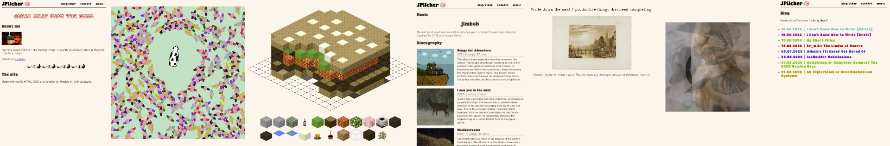

# [My Personal Site](https://jamespilcher.github.io)
## What?
- 📝 A Blog 
- 🎨 [Interactive Art](https://jamespilcher.github.io/codeArt) (using JavaScript as a medium)
- 🎶 Information About My Music 


I'd like to add more, like a picture gallery and shortfilms section, but I don't want to over-complicate the site. At the moment, these sections are blog entries.

 

## Why?

I typically use the phrase "just above mundane" to describe the site.

The goal was to induce a sense of nostalgia and offer an engaging, widely accessible, site-wide experience that could captivate users in a unique way. It being a personal site, it's very "true to me" - I find it cool and hope others do to.

It's reminicant of the early-internet days: focusing on fun, simple, human-computer interaciton.

## How?

Made from scratch in vanilla HTML/CSS/JS.

```
- jamespilcher.github.io
    - Home
    - Blog
    - CodeArt
    - Music
```

If you are curious, the navbar/footer is dynamically created by linking a JS file to each page. Not ideal but convenient...

## Where?

[jamespilcher.github.io](https://jamespilcher.github.io)

## Who?
Authored by James Pilcher
